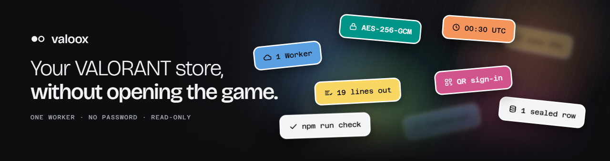
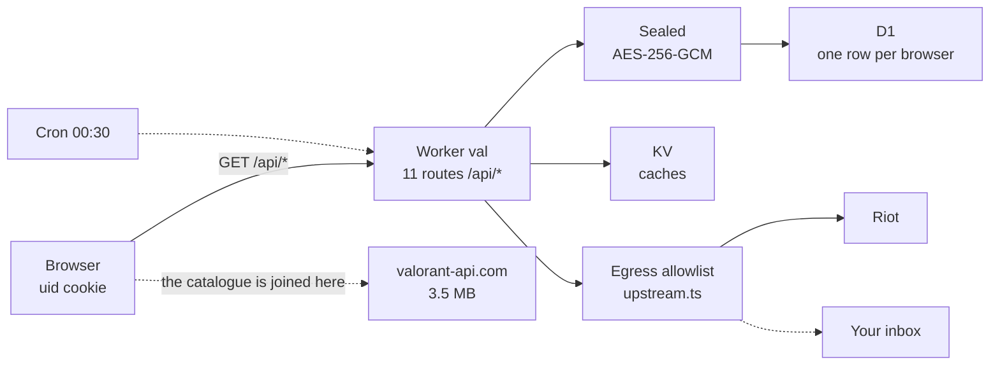

# valoox

Your VALORANT daily store and your collection, on your phone, without opening
the game.

One Cloudflare Worker on the free plan. Sign in by scanning a QR code with Riot
Mobile — there is no password field on any screen, because the password never
comes here.

**[valoox.store](https://valoox.store)**

## What it does

- Today's store, the night market, bundles and the weekly accessory store, with
  what you already own marked.
- Your whole collection: every weapon, skin, variant and chroma, plus sprays,
  buddies, cards and titles.
- Star anything. If it turns up in your store, you get one email, once, just
  after the store rotates.

## The file to read first

`src/vault/upstream.ts` is the egress allowlist: host, path and method, frozen.
Every outbound request passes it before `fetch` is called, and the endpoints
that **change** something — buy, equip, queue, party, chat — are simply not on
it. That is what makes "read-only" checkable instead of promised.

Nineteen rules. The number is on the Account screen and a test fails if the two
disagree.

## How the pieces fit

- **The session is sealed before it reaches the database.** AES-256-GCM under a
  key derived per browser, with the key in the Worker's secrets and never in
  D1. One row per signed-in browser; the Riot account id lives inside the
  sealed blob and is never a column.
- **The Worker parses no catalogue.** Names, artwork, tiers and clips are
  joined in the browser against `valorant-api.com`. A Worker gets 10ms of CPU
  per request, and that one number decided the architecture.
- **Nothing loads from a third party.** No CDN, no font host, no analytics. The
  only hosts anywhere in the CSP are Riot's own, one per directive.



[Interactive diagram](docs/arquitectura.html), generated from
`docs/arquitectura.json`.

## Which version you are looking at

The account screen prints the commit the deployed page was built from and
links to it here. That says where the code came from, not who put it up.

When a deploy runs from CI the browser bundle is attested with Sigstore, and
then it is checkable without taking my word for it:

```sh
curl -sO https://valoox.store/app.js
gh attestation verify app.js --repo NicolasV7/valoox
```

That covers the browser half. Cloudflare publishes no hash of the Worker
bundle it runs, so there is no way from outside to confirm the Worker
answering a request is this commit. [`SECURITY.md`](SECURITY.md) says so too.

## Running it

```sh
npm ci
npm run fonts     # once — downloads the two typefaces
npm run art       # once — downloads the fixed artwork
npm run dev       # builds the front end, then starts the Worker
npm run check     # typecheck + lint + tests + build. What CI runs.
```

It is a phone app, so look at it on a phone: `npm run phone` puts the dev
server behind Tailscale with a real certificate, which the `Secure` cookie
needs. `npm run phone:off` takes it down.

## What this does not claim

It is not zero-knowledge and it does not store nothing: there is one row, and
`/account/keep` lists exactly what is in it. Disconnecting deletes what we
hold — Riot's own session keeps existing on their side until it expires, and
saying otherwise would be a claim about a system nobody here controls.

Found something? [`SECURITY.md`](SECURITY.md) says what I most want to hear
about, and what is already known and is not a finding.

Not affiliated with Riot Games. VALORANT and its artwork belong to Riot Games,
Inc.

## Licence

[AGPL-3.0](LICENSE). The permissive licences let somebody run a modified copy
of this and never show you what they changed, which is the one thing a site
whose argument is "read the code" cannot allow. Run it, fork it, change it —
and if you serve it to anybody, the source of what you served has to be
available to them too.

The name and the mark are not part of that. Call your fork something else.
