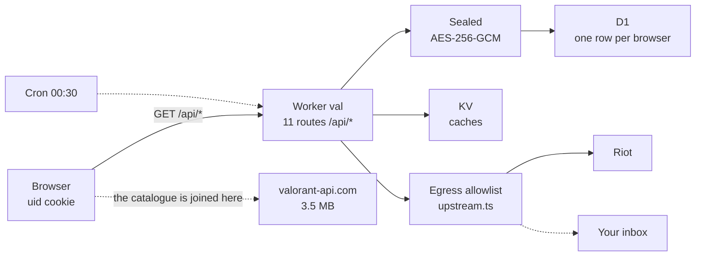

# valoox

Your VALORANT daily store and your collection, on your phone, without opening
the game.

One Cloudflare Worker on the free plan. Sign in by scanning a QR code with Riot
Mobile — there is no password field on any screen, because the password never
comes here.

**[valoox.store](https://valoox.store)**

## What it does

- Today's store, the night market, bundles and the weekly accessory store, with
  what you already own marked.
- Your whole collection: every weapon, skin, variant and chroma, plus sprays,
  buddies, cards and titles.
- Star anything. If it turns up in your store, you get one email, once, just
  after the store rotates.

## The file to read first

`src/vault/upstream.ts` is the egress allowlist: host, path and method, frozen.
Every outbound request passes it before `fetch` is called, and the endpoints
that **change** something — buy, equip, queue, party, chat — are simply not on
it. That is what makes "read-only" checkable instead of promised.

Nineteen rules. The number is on the Account screen and a test fails if the two
disagree.

## How the pieces fit

- **The session is sealed before it reaches the database.** AES-256-GCM under a
  key derived per browser, with the key in the Worker's secrets and never in
  D1. One row per signed-in browser; the Riot account id lives inside the
  sealed blob and is never a column.
- **The Worker parses no catalogue.** Names, artwork, tiers and clips are
  joined in the browser against `valorant-api.com`. A Worker gets 10ms of CPU
  per request, and that one number decided the architecture.
- **Nothing loads from a third party.** No CDN, no font host, no analytics. The
  only hosts anywhere in the CSP are Riot's own, one per directive.



[Interactive diagram](docs/arquitectura.html), generated from
`docs/arquitectura.json`.

## Running it

```sh
npm ci
npm run fonts     # once — downloads the two typefaces
npm run art       # once — downloads the fixed artwork
npm run dev       # builds the front end, then starts the Worker
npm run check     # typecheck + lint + tests + build. What CI runs.
```

It is a phone app, so look at it on a phone: `npm run phone` puts the dev
server behind Tailscale with a real certificate, which the `Secure` cookie
needs. `npm run phone:off` takes it down.

## What this does not claim

It is not zero-knowledge and it does not store nothing: there is one row, and
`/account/keep` lists exactly what is in it. Disconnecting deletes what we
hold — Riot's own session keeps existing on their side until it expires, and
saying otherwise would be a claim about a system nobody here controls.

Not affiliated with Riot Games. VALORANT and its artwork belong to Riot Games,
Inc.
