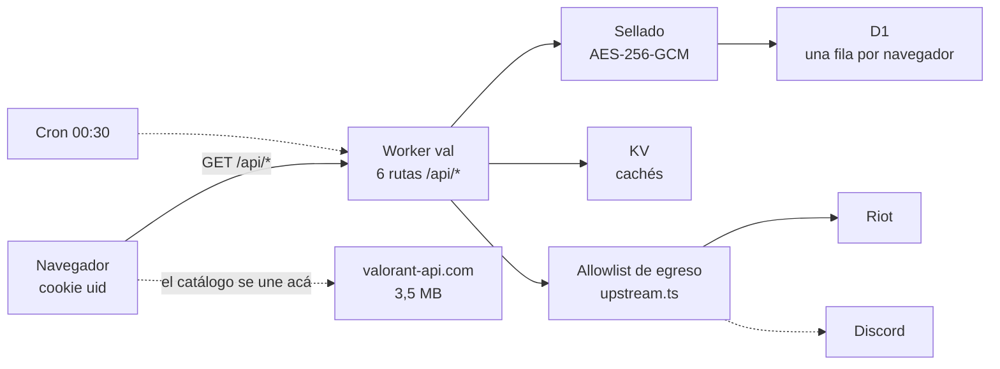

# valoox

Tu tienda diaria y tu colección de VALORANT desde el celular, sin prender el PC.

Un Worker de Cloudflare, plan gratuito, sin build step y sin dependencias en
runtime. Entrás escaneando un QR con Riot Mobile: la contraseña no pasa por acá.

## Arquitectura



[Diagrama interactivo](docs/arquitectura.html) — se regenera desde
`docs/arquitectura.json`.

## El archivo que importa

`src/vault/upstream.ts` es la allowlist de egreso: host, path y método,
congelados. Todo request que sale pasa por ahí, y los endpoints que **cambian
estado** —comprar, equipar, entrar a cola, party, chat— simplemente no están.

Eso convierte «solo lectura» de promesa en propiedad verificable: son diecisiete
reglas, se leen de una sentada, y `test/unit/upstream.test.ts` intenta alcanzar
las escrituras y exige que todas sean rechazadas.

El mismo archivo explica por qué el método es la mitad de cada regla: el `GET`
del loadout dibuja tu tarjeta en el encabezado, y el `PUT` de esa misma URL, que
la cambiaría, no existe.

## Mapa

```
design/      la especificación: DESIGN.md, tokens.css, palette.json, boards.md
web/         el navegador. TypeScript, se bundlea a public/app.js
  main.tsx         monta y rutea
  i18n/            todos los textos. es/ es el idioma fuente, en/ está lleno
  design/          measure · hsv · useArt · sprays
  components/      las cuatro formas, nav, chips, skeleton
  screens/         una por artboard
  data/            api · catalogue · types
public/      lo que se sirve tal cual: index.html, _headers, .well-known/
             app.js y app.css son artefactos; fonts/ la baja `npm run fonts`
src/         el Worker
  index.ts         fetch + scheduled
  router.ts        la tabla de rutas, el guard Sec-Fetch-Site, el embudo de error
  routes/          store · collection · auth · wishlist · alerts
  lib/json.ts      la respuesta, el Ctx que recibe una ruta
  app/cookie.ts    el uid del navegador
  types.ts         las formas que cruzan un borde de módulo
  vault/
    upstream.ts    la allowlist  <- leé esta primero
    http.ts        el único fetch() que sale. Aplica la allowlist
    live.ts        reauth y curación: lo que toda ruta de datos comparte
    auth.ts        reauth, entitlements, identify
    qr.ts          el handshake de Riot Mobile
    storefront.ts  tienda, wallet y adquiridos
    account.ts     rango y tarjeta equipada
    inventory.ts   la colección, agrupada por tipo
    alerts.ts      el canal de avisos y el chequeo diario
    seal.ts        HKDF por usuario + AES-256-GCM
    repo.ts        D1
    session.ts     lo único que persiste
    store.ts / jar.ts / shard.ts / owned.ts / constants.ts
```

Ningún archivo pasa de 200 líneas y ningún texto visible vive fuera de
`web/i18n/`. Las dos son tests, no convenciones: `size.test.ts` y
`strings.test.ts`. El front no usa `innerHTML` en ningún lado y la CSP es
`default-src 'none'`; `seams.test.ts` falla si eso cambia.

El color detrás de cada pieza se mide de su propio arte — `web/design/hsv.ts`,
y `measure.test.ts` lo compara contra 57 colores calculados offline.

## Correr

```sh
npm ci
npm run fonts        # una vez: baja las dos tipografías a public/fonts/
npm run dev          # compila web/ y levanta el Worker
npm run check        # tipos + lint + 92 tests + build
npm run deploy
```

El interruptor, que deja indescifrable todo ciphertext que exista y desloguea a
todos:

```sh
npx wrangler secret put JAR_KEY
```

## Lo que hay que decir

**Borrar tu sesión revoca nuestro acceso, no la credencial.** Del lado de Riot
sigue viva hasta que vence sola. La única muerte real es cerrar sesión en todos
los dispositivos desde Riot Mobile.

**Riot no aprueba esto.** Su política lista «online store tracking» como caso no
aprobado. Es su decisión, no la nuestra.
